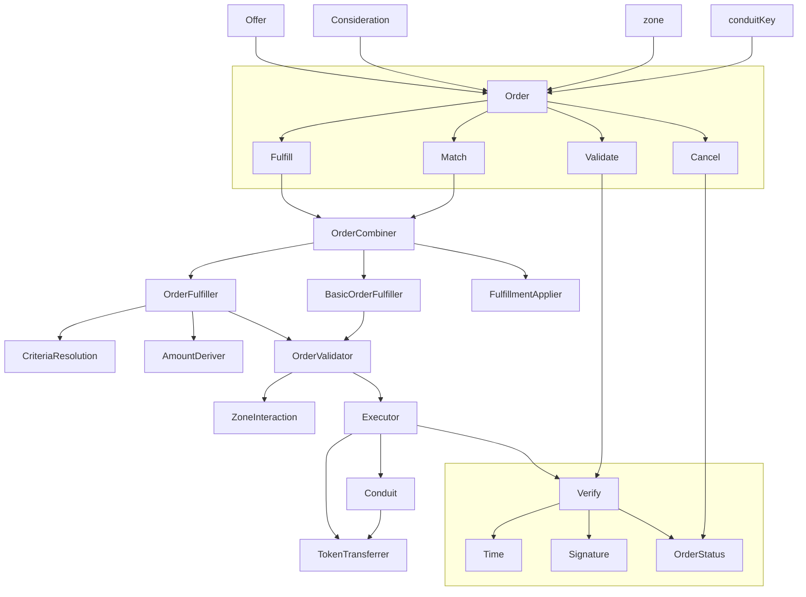

# Developer resources for learning about Seaport

## Introduction
[Seaport](https://github.com/ProjectOpenSea/seaport) is an NFT marketplace protocol developed and used by [OpenSea](https://opensea.io/). It was [first introduced](https://twitter.com/opensea/status/1527705996549685248?lang=en) in May 2022 as an upgrade to OpenSea's previous marketplace protocol, [Wyvern](https://github.com/wyvernprotocol/wyvern-v3), significantly reducing gas costs and adding new features such as bulk buying/selling, supporting different payment currencies, etc.            

### Architecture:

## Links
- [Etherscan](https://etherscan.io/address/0x00000000000001ad428e4906ae43d8f9852d0dd6#code)
- [GitHub](https://github.com/ProjectOpenSea/seaport)
- [Docs](https://docs.opensea.io/v2.0/reference/seaport-overview)
- [Discord](https://discord.gg/9jcjC5XMrr)

## Videos:
- [Devcon Bogota 2022: "Advanced Seaport Techniques" workshop](https://www.youtube.com/watch?v=YLWnaSymFHA)
- [Into the Bytecode: Podcast](https://www.youtube.com/watch?v=d4JSkpiEyd8)
- [ETHGlobal 2022: "Seaport Protocol Intro"](https://www.youtube.com/watch?v=H9iSgju3qIc)
- [Solidity Fridays: "Seaport from OpenSea"](https://www.youtube.com/watch?v=juP22m8kiKM)
- [NFTNYC 2022: "Introducing the Seaport protocol"](https://www.youtube.com/watch?v=XHVk5Se5ChA)
- [ETHGlobal 2022: OpenSea 🛠 Basic and Advanced Seaport Techniques - Ryan Ghods](https://www.youtube.com/watch?v=Rl8ydxrSM6Y)

## Other Relevant Repositories:
- [SeaportJS](https://github.com/ProjectOpenSea/seaport-js)
- [Seaport Order Validator](https://github.com/ProjectOpenSea/seaport-order-validator)
- [Seaport Improvement Proposals (SIPs)](https://github.com/ProjectOpenSea/SIPs)

## Marketplaces/Projects using Seaport:
- [OpenSea](https://opensea.io)
- [Blur](https://blur.io)
- _Create a PR and add your project here_

## Main contributors to follow:
- [z0age](https://twitter.com/z0age)
- [Kartik](https://twitter.com/Slokh)
- [Ryan](https://twitter.com/ralxzryan)
- [emo](https://twitter.com/emo_eth)

## Relevant EIPs 
- [EIP-20: Token Standard](https://eips.ethereum.org/EIPS/eip-20)
- [EIP-712: Typed structured data hashing and signing](https://eips.ethereum.org/EIPS/eip-712)
- [EIP-721: Non-Fungible Token Standard](https://eips.ethereum.org/EIPS/eip-721)
- [EIP-2098: Compact Signature Representation](https://eips.ethereum.org/EIPS/eip-2098)
- [EIP-2612: Permit Extension for EIP-20 Signed Approvals](https://eips.ethereum.org/EIPS/eip-2612)
- [EIP-1271: Standard Signature Validation Method for Contracts](https://eips.ethereum.org/EIPS/eip-1271)
- [EIP-2981: NFT Royalty Standard](https://eips.ethereum.org/EIPS/eip-2981)
- [EIP-4337: Account Abstraction Using Alt Mempool](https://eips.ethereum.org/EIPS/eip-4337)
- [EIP-4906: EIP-721 Metadata Update Extension](https://eips.ethereum.org/EIPS/eip-4906)

## Other Marketplaces
- Old Blur contract (Blur currently uses Seaport) ([Etherscan](https://etherscan.io/address/0x031aa05da8bf778dfc36d8d25ca68cbb2fc447c6#code))
- LooksRare ([Etherscan](https://etherscan.io/address/0x59728544B08AB483533076417FbBB2fD0B17CE3a#code), [GitHub](https://github.com/LooksRare), [Docs](https://docs.looksrare.org/developers/welcome), [Discord](https://discord.gg/looksraredevelopers))
- Rarible ([Etherscan](https://etherscan.io/address/0x4fee7b061c97c9c496b01dbce9cdb10c02f0a0be#code))
- X2Y2 ([Etherscan](https://etherscan.io/address/0x74312363e45dcaba76c59ec49a7aa8a65a67eed3#code))
- Sudoswap ([Etherscan](https://etherscan.io/address/0x2B2e8cDA09bBA9660dCA5cB6233787738Ad68329#code), [GitHub](https://github.com/sudoswap), [Docs](https://docs.sudoswap.xyz/))
- Foundation ([Etherscan](https://etherscan.io/address/0xcda72070e455bb31c7690a170224ce43623d0b6f#code), [GitHub](https://github.com/f8n), [Docs](https://docs.foundation.app/docs/))
- 0x ([Docs](https://docs.0x.org/nft-support/docs))
